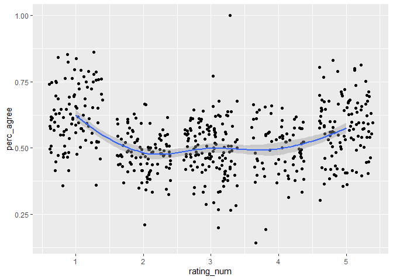

<!-- README.md is generated from README.Rmd. Please edit that file -->

# AllSideR

<!-- badges: start -->

<!-- badges: end -->

The goal of AllSideR is to provide you with the
[AllSides.com](AllSides.com) Media Bias rating dataset.

## Load Dataset

``` r
library(tidyverse)

allsides_data <- read_rds("data/allsides_data.RDS")

allsides_data %>% 
  head() %>% 
  knitr::kable()
```

| news\_source      | agree | disagree | rating      | url                                                                   | perc\_agree | rating\_num | type                      | editorial\_review | community\_feedback | blind\_survey | third\_party\_analysis | independent\_research | confidence\_level     | twitter                            | wiki                                                           | facebook                               | screen\_name  |
| :---------------- | ----: | -------: | :---------- | :-------------------------------------------------------------------- | ----------: | ----------: | :------------------------ | :---------------- | :------------------ | :------------ | :--------------------- | :-------------------- | :-------------------- | :--------------------------------- | :------------------------------------------------------------- | :------------------------------------- | :------------ |
| AARP              |  1404 |     2343 | center      | <https://www.allsides.com/news-source/aarp-media-bias>                |   0.3746998 |           3 | Think Tank / Policy Group | 0                 | 0                   | 0             | 0                      | 0                     | NA                    | <https://twitter.com/AARP>         | <https://en.wikipedia.org/wiki/AARP>                           | NA                                     | AARP          |
| ABC News          | 13793 |     9409 | left-center | <https://www.allsides.com/news-source/abc-news-media-bias>            |   0.5944746 |           2 | News Media                | 0                 | 0                   | 1             | 1                      | 1                     | High                  | <https://twitter.com/ABC>          | <https://en.wikipedia.org/wiki/ABC_News>                       | <https://www.facebook.com/ABCNews/>    | ABC           |
| Abridge News      |    31 |       17 | allsides    | <https://www.allsides.com/news-source/abridge-news-media-bias>        |   0.6458333 |          NA | News Media                | 0                 | 0                   | 0             | 0                      | 1                     | High                  | <https://twitter.com/Abridge_News> | NA                                                             | <https://www.facebook.com/AbridgeNews> | Abridge\_News |
| Accuracy in Media |   743 |      444 | right       | <https://www.allsides.com/news-source/accuracy-media>                 |   0.6259478 |           5 | Think Tank / Policy Group | 0                 | 0                   | 0             | 0                      | 1                     | Medium                | NA                                 | <https://en.wikipedia.org/wiki/Accuracy_in_Media>              | NA                                     | NA            |
| ACLU              |  1272 |     1697 | left-center | <https://www.allsides.com/news-source/american-civil-liberties-union> |   0.4284271 |           2 | Think Tank / Policy Group | 0                 | 0                   | 0             | 0                      | 0                     | NA                    | <https://twitter.com/@ACLU>        | <https://en.wikipedia.org/wiki/American_Civil_Liberties_Union> | <https://www.facebook.com/aclu/>       | ACLU          |
| AJ+               |    13 |        5 | left        | <https://www.allsides.com/news-source/aj-media-bias>                  |   0.7222222 |           1 | News Media                | 0                 | 0                   | 0             | 0                      | 1                     | Low or Initial Rating | NA                                 | NA                                                             | NA                                     | NA            |

``` r
allsides_data %>% 
  ggplot(aes(rating_num, perc_agree)) +
  geom_jitter() +
  geom_smooth()
```

<!-- -->

People agree more on bias of partisan media.

``` r

  

allsides_data %>% 
  mutate(partisan = case_when(
    rating_num %in% c(2, 4) ~ "Slightly Partisan",
    rating_num %in% c(1, 5) ~ "Partisan",
    rating_num == 3 ~ "Center"
  )) %>% 
  drop_na(partisan) %>% 
  mutate(partisan = fct_relevel(partisan, c("Center", "Slightly Partisan", "Partisan"))) %>% 
  ggplot(aes(partisan, perc_agree)) +
  geom_jitter(alpha = 0.4)  +
  geom_violin(alpha = 0.4) +
  geom_boxplot(width = 0.2)
```

<!-- -->

``` r
allsides_data %>%
  ggplot(aes(rating_num, fill = type)) +
  geom_density(alpha = .4)
```

<!-- -->

Lacks of right-wing media is filled by “Authors”?
